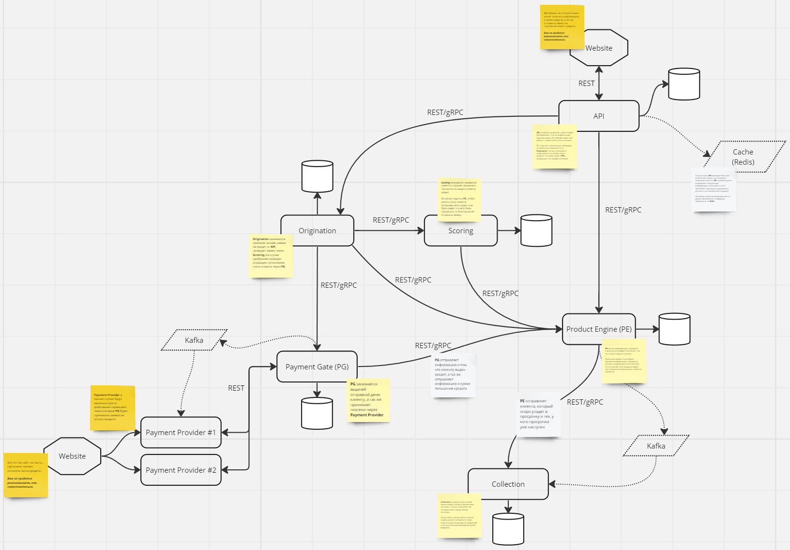

# 🏛️ Tink Bank

This project is a banking application that allows users to manage their finances.


## Introduction

For detailed information about each service, navigate to their respective documentation directories located at ```./serviceName/doc```

### System Design:

[Link](https://miro.com/app/board/uXjVNWFTMec=/)



## Getting Started


### Dependencies

All project dependencies are centrally managed in the `gradle/libs.versions.toml` file.

### Installing

Clone the repo:
```
git clone https://github.com/T9404/TinkBank.git 
```

Launch the [Docker](https://www.docker.com/get-started/) app.

Build the project using Gradle in the root directory:

```
./gradlew build
```

Run the Dockerized application in the root directory:
```
docker compose up --build -d
```

